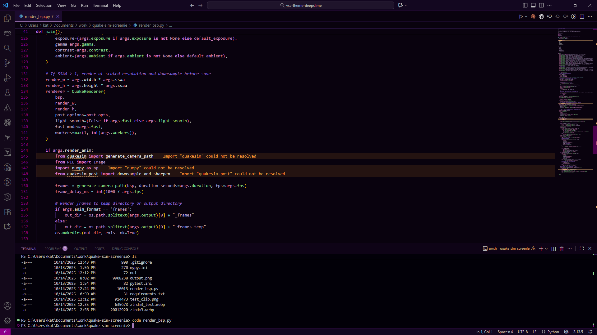
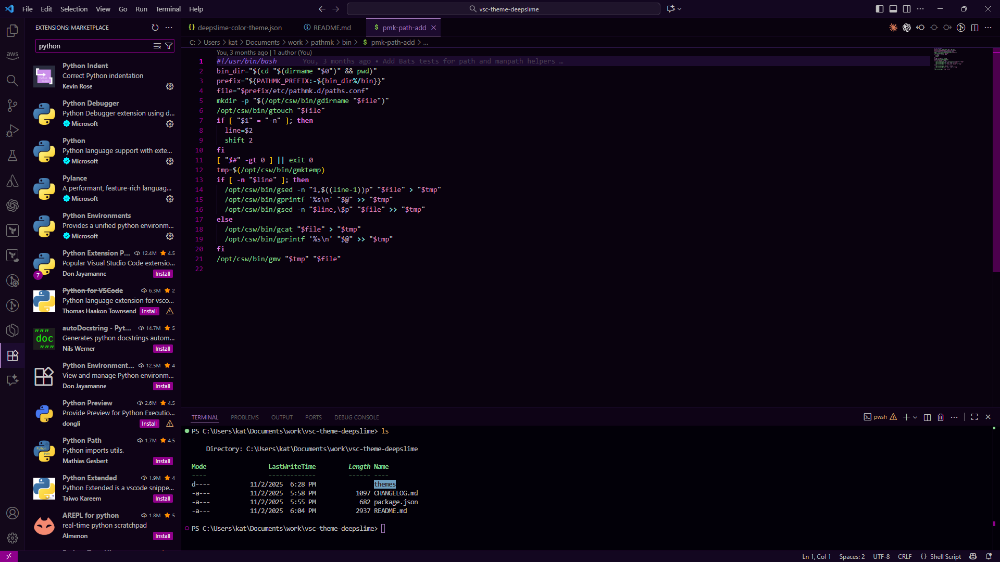

# Deepslime Theme

A dark, sophisticated theme for Visual Studio Code with desaturated neon colors and a deep magenta-tinted background. Designed for extended coding sessions with excellent readability and visual hierarchy.





## Features

- **Deep, dark backgrounds** with subtle magenta undertones that are easy on the eyes
- **Desaturated color palette** for improved readability and reduced eye strain
- **High contrast** between editor and UI panels for clear visual hierarchy
- **Extensive language support** with comprehensive syntax highlighting for 50+ languages
- **Distinct token colors** making code structure easily recognizable
- **Terminal integration** with carefully tuned ANSI colors that won't interfere with CLI tools

## Color Palette

### Background Colors
- **Editor Background**: `#08020E` (Nearly black with magenta undertone)
- **Terminal Background**: `#020008` (Darkest, pure black with subtle tint)
- **Sidebar/Panels**: `#0D0416` (Dark purple-black)
- **Activity Bar**: `#12091A` (Slightly brighter magenta-purple)
- **Title/Status Bar**: `#120820` (Dark purple)

### Syntax Colors (Desaturated Neon)
- **Functions/Methods**: `#8FD98F` (Soft green)
- **Keywords/Classes**: `#D97FD9` (Soft magenta)
- **Variables/Properties**: `#D988BA` (Soft pink)
- **Strings/Parameters**: `#B8A4CC` (Lavender)
- **Operators/Attributes**: `#7DCDCD` (Soft cyan)
- **Types/Numbers**: `#CC99BB` (Soft mauve)
- **Comments**: `#9370DB` (Muted purple, italic)
- **Constants**: `#CC99BB` (Soft mauve)

## Supported Languages

### Full Syntax Highlighting Support:
- ARB
- Batch files (bat)
- C/C++
- C#
- Caddyfile
- CSS/SCSS/SASS
- Dart
- FreeMarker
- Handlebars
- HTML/XHTML
- .htaccess
- Java
- JavaScript/TypeScript
- Jinja2
- JSON
- JSP
- Kotlin
- Markdown
- Mustache
- Perl
- PHP
- PowerShell (ps1)
- Properties/INI/ENV/CONF files
- Python
- QuakeC
- Requirements.txt
- Ruby
- Shell scripts (sh, bash)
- SVG
- Swift
- Terraform
- TOML
- Velocity
- XML
- YAML

### Additional Support:
- Assembly (.s, .asm)
- Erlang
- Fortran
- HAML
- Haskell
- Lisp/Scheme
- M4
- Objective-C
- OCaml
- Pascal
- Visual Basic (bas, vbs)

## Customization

You can override specific colors in your `settings.json`:

```json
{
  "workbench.colorCustomizations": {
    "[Deepslime]": {
      "editor.background": "#08020E"
    }
  },
  "editor.tokenColorCustomizations": {
    "[Deepslime]": {
      "comments": "#9370DB"
    }
  }
}
```

## Contributing

Found an issue or want to suggest improvements? Please open an issue on the [GitHub repository](https://github.com/wintryKat/vsc-theme-deepslime).

## License

MIT License - see [LICENSE](LICENSE) file for details.

---

**Enjoy coding with Deepslime!**
