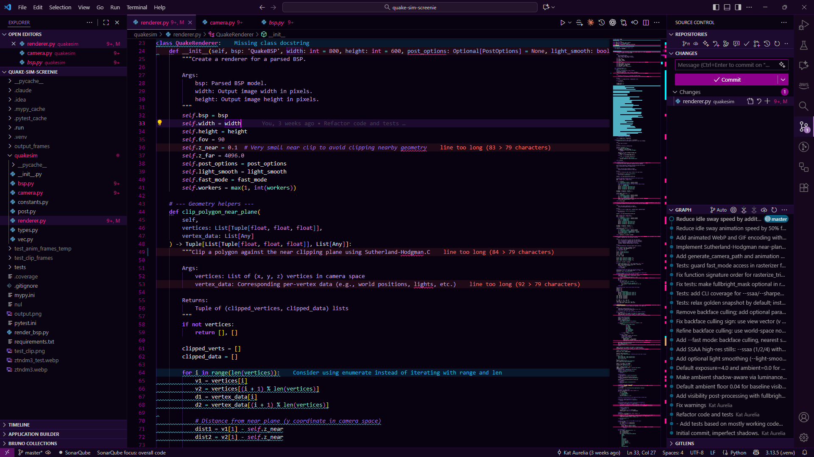
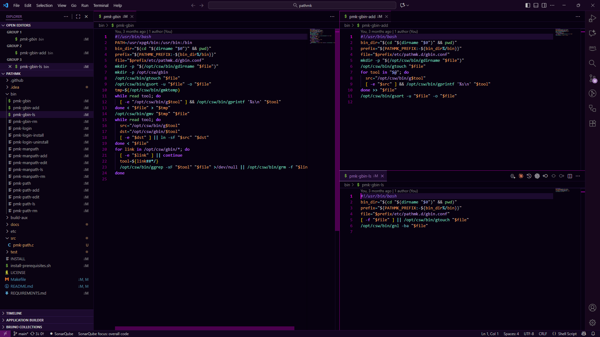

# Deepslime Theme

A dark, sophisticated theme for Visual Studio Code with desaturated neon colors and a deep magenta-tinted background. Designed for extended coding sessions with excellent readability and visual hierarchy.





## Changelog

### v1.1.3 (Current)
**Readability & Contrast Improvements:**
- **Editor Background Brightening**: Slightly increased editor background brightness (#060110) to improve VS Code logo visibility on empty screens
- **Pane Background Darkening**: Reduced brightness of sidebar and panel backgrounds (#090312) to better focus attention on code
- **Menu & Activity Bar Enhancement**: Increased red levels in menus and activity bars for stronger magenta presence
- **Remote-SSH Status Bar**: Significantly reduced brightness and saturation of Remote-SSH indicator for extended remote sessions
- **Icon & Label Contrast**: Improved contrast for checkmarks, success labels, and badges by darkening backgrounds
- **Class Name Readability**: Reduced brightness and saturation of class names and enums (#D850C0) for better readability
- **Squiggle Refinement**: Toned down info/hint squiggles (#50B0C0) to be less distracting while maintaining visibility
- **Chart/Badge Colors**: Darkened all chart colors for proper contrast with white text in git graphs and badges

### v1.1.2
**Major Enhancements:**
- **Darker Editor Backgrounds**: Enhanced contrast with darker code pane backgrounds for improved focus
- **Enhanced Terminal Colors**: Significantly increased ANSI color saturation for better log differentiation
- **Improved Code Syntax Differentiation**: Distinct colors for keywords, types, functions, and variables
- **Improved Welcome Screen**: Darkened keyboard hint backgrounds while maintaining bright pink text
- **Enhanced Accessibility**: Color choices optimized for various types of color blindness
- **Debug Console Improvements**: Increased text brightness for better readability
- **Terminal Optimization**: Darker backgrounds for reduced eye strain during long sessions

### v1.0.0
- Initial release with desaturated neon color palette
- Support for 50+ programming languages
- Deep magenta-tinted backgrounds for reduced eye strain

## Features

- **Ultra-dark backgrounds** with subtle magenta undertones for maximum eye comfort
- **Enhanced color differentiation** with distinct hues for each code element type
- **Improved accessibility** with color choices optimized for various types of color blindness
- **Vivid terminal colors** with high saturation for easy log scanning while remaining comfortable
- **High contrast** between editor and UI panels for clear visual hierarchy
- **Extensive language support** with comprehensive syntax highlighting for 50+ languages
- **Distinct token colors** making code structure easily scannable at a glance
- **Optimized string interpolation** with highly visible delimiters
- **Carefully tuned punctuation** colors that don't interfere with code comprehension

## Color Palette

### Background Colors
- **Editor Background**: `#060110` (Nearly pure black with subtle magenta undertone)
- **Terminal Background**: `#020108` (Pure black with minimal tint)
- **Sidebar/Panels**: `#090312` (Dark purple-black)
- **Activity Bar**: `#16081C` (Slightly brighter magenta-purple)
- **Title/Status Bar**: `#160820` (Dark purple)
- **Keybinding Labels**: `#000000` (Pure black for maximum contrast)

### Syntax Colors (Desaturated Neon)
- **Functions/Methods**: `#80E0C0` (Cyan-green - accessible and distinct)
- **Keywords**: `#B060FF` (Blue-purple - bold)
- **Classes/Types**: `#D850C0` (Refined magenta - bold, readable)
- **Variables/Properties**: `#F0A060` (Desaturated neon orange - excellent contrast)
- **Strings**: `#C0A0E0` (Lavender)
- **Parameters**: `#A0B0E0` (Blue-purple, distinct from strings)
- **String Interpolation**: `#60D0C0` (Bright cyan - bold for visibility)
- **Operators/Attributes**: `#7DCDCD` (Soft cyan)
- **Types/Numbers**: `#CC99BB` (Soft mauve)
- **Comments**: `#9370DB` (Muted purple, italic)
- **Brackets/Punctuation**: `#9090B0` (Desaturated gray-purple)
- **Semicolons/Commas**: `#C0C0C0` (Light gray)

## Supported Languages

### Full Syntax Highlighting Support:
- ARB
- Batch files (bat)
- C/C++
- C#
- Caddyfile
- CSS/SCSS/SASS
- Dart
- FreeMarker
- Handlebars
- HTML/XHTML
- .htaccess
- Java
- JavaScript/TypeScript
- Jinja2
- JSON
- JSP
- Kotlin
- Markdown
- Mustache
- Perl
- PHP
- PowerShell (ps1)
- Properties/INI/ENV/CONF files
- Python
- QuakeC
- Requirements.txt
- Ruby
- Shell scripts (sh, bash)
- SVG
- Swift
- Terraform
- TOML
- Velocity
- XML
- YAML

### Additional Support:
- Assembly (.s, .asm)
- Erlang
- Fortran
- HAML
- Haskell
- Lisp/Scheme
- M4
- Objective-C
- OCaml
- Pascal
- Visual Basic (bas, vbs)

## Customization

You can override specific colors in your `settings.json`:

```json
{
  "workbench.colorCustomizations": {
    "[Deepslime]": {
      "editor.background": "#060110",
      "terminal.background": "#020108"
    }
  },
  "editor.tokenColorCustomizations": {
    "[Deepslime]": {
      "comments": "#9370DB",
      "variables": "#F0A060"
    }
  }
}
```

## Contributing

Found an issue or want to suggest improvements? Please open an issue on the [GitHub repository](https://github.com/wintryKat/vsc-theme-deepslime).

## License

MIT License - see [LICENSE](LICENSE) file for details.

---

**Enjoy coding with Deepslime!**
